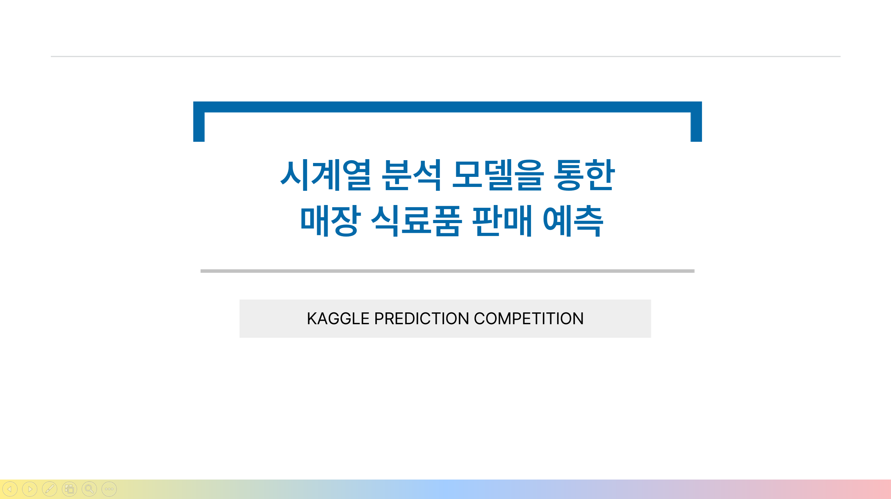
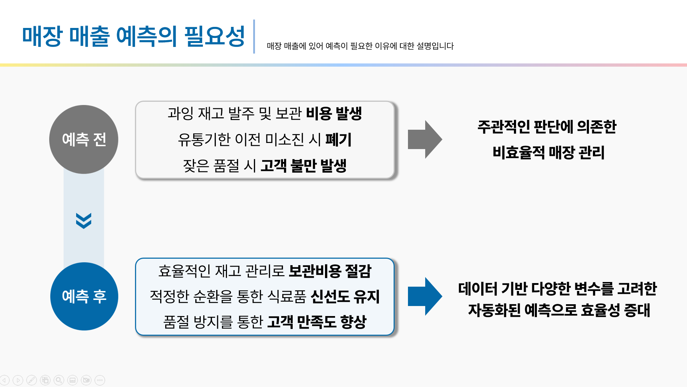
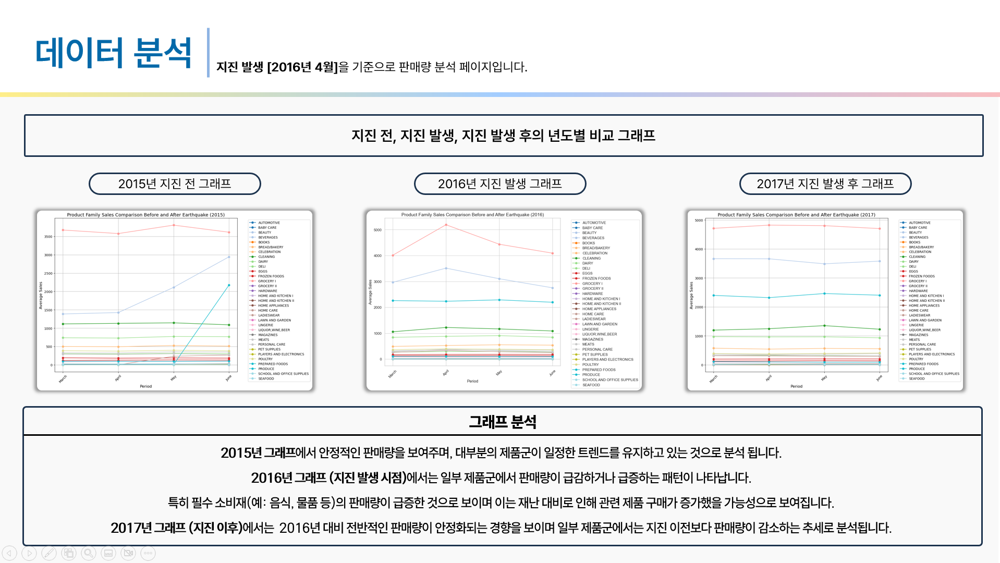
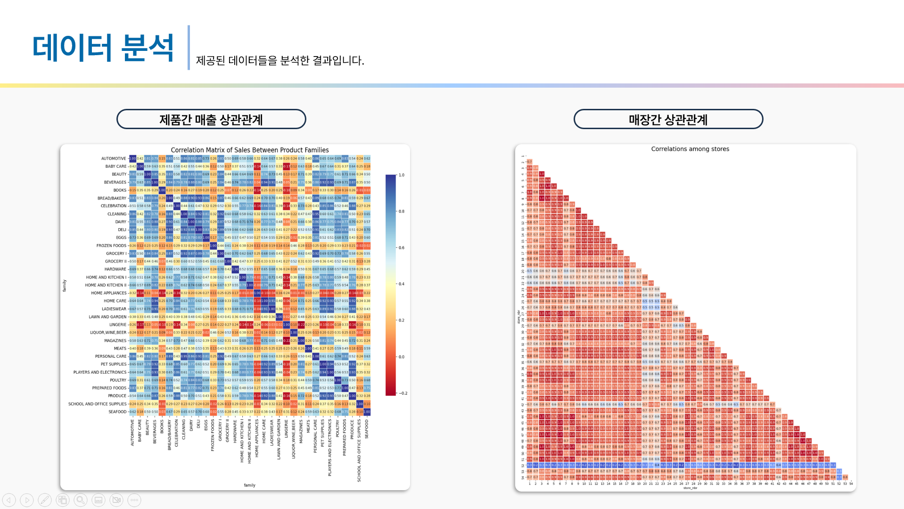
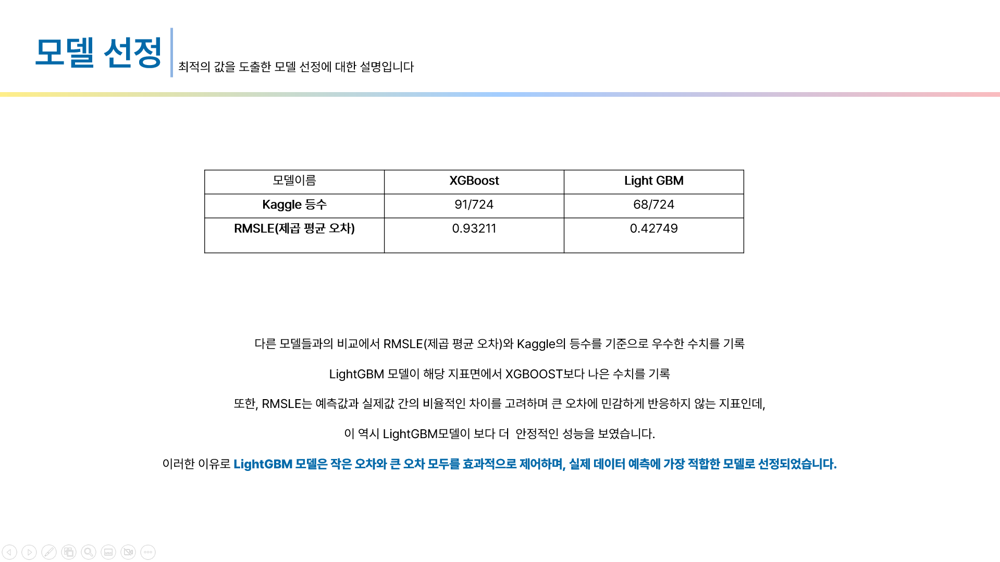

# 📉 시계열 분석 모델을 통한 매장 식료품 판매 예측

### 📅 **개발 기간**  
2024.10.04 ~ 2024.10.23

### 🌟 **프로젝트 개요**  
- **프로젝트 명:** 시계열 분석 모델을 통한 매장 식료품 판매 예측  
- **참여 인원:** 4명  

---

### 주요 역할

#### 1. 모델 성능 분석  
- XGBoost 모델을 활용하여 예측 모델을 개발하고, SARIMAX 및 LGBM 모델과의 성능 비교 분석을 통해 최적의 모델을 선정했습니다.  

#### 2. 모델 설계 및 성능 최적화  
- 다양한 하이퍼파라미터 조정 및 기법을 활용해 모델을 설계하고, 예측 정확성을 극대화하는 데 중점을 두었습니다.  

#### 3. 시각화 및 모델 평가  
- 데이터 전처리 후, 매출 데이터를 기반으로 다양한 그래프를 시각화하여 모델 성능을 평가했습니다.  
- XGBoost 모델의 성능을 집중적으로 분석하며 최적의 결과를 도출했습니다.  

---

### 분석 목표  
- 특정 제품의 가격 변화를 예측하는 모델 설계  
- 다양한 시계열 모델 간 성능 비교 및 최적 모델 선정  
- **캐글(Kaggle) 대회에서 상위 순위 달성**  

### 🛠 주요 성과  
- **캐글(Kaggle) 대회에서 상위 10%** 달성  
- XGBoost 모델 설계 및 최적화를 통해 예측 성능 향상  
- 모델 성능 비교 및 최적화 과정에서 중요한 인사이트 도출  

  
  ---
  ### 🌟 프로젝트 이미지
- 아래는 프로젝트 발표 자료에서 사용된 대표 슬라이드입니다.
<table align="center">
  <tr>
    <td align="center">
      
      
시계열 분석 메인 슬라이드

    </td>
    <td align="center">
      
      
데이터 탐색

    </td>
    <td align="center">
      
      
데이터 분석

  <td align="center">
      
      
데이터 분석

  <td align="center">
      
      
데이터 결과

    </td>
  </tr>
</table>

---

### 🔗 프로젝트 문서
- 전체 발표 슬라이드 PDF: [시계열 분석.PDF](./시계열%20분석.pdf)

---

### 🛠 주요 기술 및 도구
- **데이터 수집:** 캐글 데이터  
- **데이터 분석:** Python, Excel
- **모델 개발:** XGBoost

