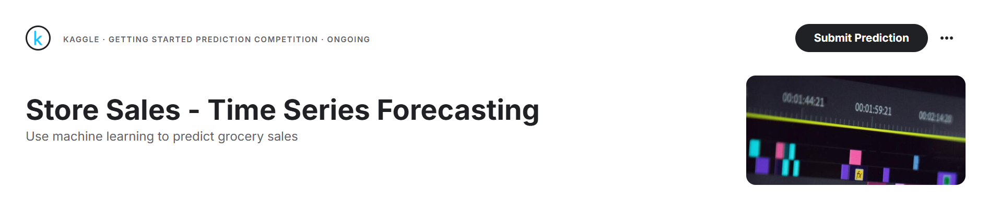

# 📉 시계열 데이터를 활용한 가격 예측 모델

### 📅 **개발 기간**  
2024.10.04 ~ 2024.10.23

### 🌟 **프로젝트 소개**  
- **프로젝트 명:** 시계열 데이터를 활용한 가격 예측 모델  
- **프로젝트 제작 인원:** 4명

- **주요 역할:**  
  - XGBoost, SARIMAX, LGBM 모델을 활용한 성능 비교 분석  
  - 모델 설계 및 성능 최적화  
  - 예측 결과 시각화 및 모델 평가

- **분석 목표:**  
  - 특정 제품의 가격 변화를 예측하는 모델 설계  
  - 다양한 시계열 모델을 비교하여 가장 적합한 모델 선정  
  - **캐글(Kaggle) 대회에서 상위 순위 달성**

### 🛠 **주요 성과**    
- **캐글(Kaggle) 대회에서 상위 10%** 달성
- XGBoost 모델 설계 및 최적화를 통해 예측 성능 향상
- 모델 성능 비교 및 최적화 과정에서 중요한 인사이트 도출  
  
  ---
  ### 🌟 프로젝트 이미지
- 아래는 프로젝트 발표 자료에서 사용된 대표 슬라이드입니다.
<table align="center">
  <tr>
    <td align="center">
      
      
태풍 분석 메인 슬라이드

    </td>
    <td align="center">
      
      
데이터 탐색

    </td>
    <td align="center">
      
      
데이터 분석

    </td>
  </tr>
</table>

---

### 🔗 프로젝트 문서
- 전체 발표 슬라이드 PDF: [태풍 분석 발표 PDF](./태풍_분석.pdf)

---

### 🛠 주요 기술 및 도구
- **데이터 수집:** 캐글 데이터  
- **데이터 분석:** Python, Excel
- **모델 개발:** XGBoost

